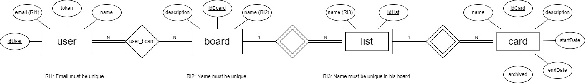
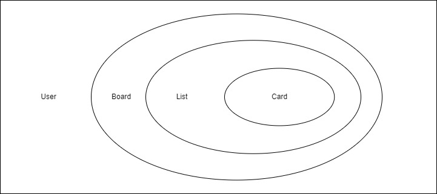

# LS Project Phase 1
## Introduction
This document presents the design and implementation aspects of the LS Project's first phase.  
The system is designed to manage information related to Trello Boards and their elements, such as boards, lists and cards. 

This application aims to provide a task management system.  
It allows users to create, read, update and delete tasks, as well as organize them in different categories including the usage of the entities:  
User, Board, List, Card most of them inside [Structs.kt](../src/main/kotlin/pt/isel/ls/server/utils/Structs.kt).  

The application is built using the Kotlin programming language and follows a RESTful API architecture, where data is exchanged in JSON format.\
The application also provides an Open-API specification that documents the API endpoints and their usage.

## Modeling the Database
### Conceptual Model
The following diagram shows the Entity-Relationship model for the system's information management.

We highlight the following aspects of the conceptual model:

__Boards__ have a title, description, and creation date.\
__Lists__ belong to a board and have a title and position.\
__Cards__ belong to a list and have a title, description, position, and due date.
The conceptual model has the following restrictions:

- A board can have multiple lists.
- A list can have multiple cards.
- A card can belong to only one list.

### Physical Model
The physical model of the database is available in the [SQL script](../src/main/sql/createTable.sql) with the schema definition.

We highlight the following aspects of this model:

The tables are named __user__ , __user_board__ (*) , __board__, __list__, and __card__.
The columns are named after the __attributes__ of the conceptual model.
The foreign keys are properly defined to maintain the relationships.

(*) In a many-to-many relationship between user and board, where each user can be associated with multiple boards and each board can be associated with multiple users.  
We cannot directly represent this relationship with only user and board tables.

In this case, the __user_board__ table serves as the junction table that connects the user and board tables. 
It contains foreign keys to both user and board tables, as well as any additional columns that are specific to the relationship between a user and a board.
## Software Organization
### Open-API Specification
The [OpenAPI](../docs/apiRoutes.yaml) specification for the system is available in the YAML file.

In our Open-API specification, we highlight the following aspects:

- The endpoints are defined for managing users, boards, lists, and cards.
- The request and response formats are properly defined.
- The error responses are properly defined.
- The endpoints are grouped into logical groups.

### Request Details
When a request is received by the system, it goes through the following elements:

The HTTP server receives the request.
The routing middleware routes the request to the corresponding endpoint handler.
The endpoint handler validates the request parameters and calls the appropriate service method.
The service method performs the required data access and returns the response.
The endpoint handler returns the response to the client.
The relevant classes/functions used internally in a request are:

HttpServer: the HTTP server implementation.
Router: the routing middleware implementation.
Endpoint handler functions: the functions that handle the requests for each endpoint.
Service classes: the classes that perform the data access and business logic for each endpoint.
The request parameters are validated in the endpoint handler functions, using the HTTP4K library's validation functions.

### Connection Management
Connections to the database are created, used, and disposed of by the Database class.  
The Database class uses the HikariCP connection pool to manage the connections.

The connection management is integrated with transaction scopes.  
Each service method executes in a transaction, which is created and committed or rolled back by the Database class.

### Data Access
The Database class is responsible for data access. It provides helper functions for executing SQL statements and mapping the results to domain objects.

Non-trivial SQL statements are used for querying the data related to a board, list, or card.

### Error Handling/Processing
Errors are handled and processed by the ErrorHandler middleware. When an error occurs in any of the middleware or endpoint handler functions, it is caught by the ErrorHandler. The ErrorHandler maps the error to the appropriate HTTP status code and returns an error response to the client.

The TrelloException class is used to define custom exceptions for specific error situations, such as unauthorized operations or invalid parameters.

## Critical Evaluation
Functionality that is not yet concluded:

None identified.
Identified defects:

None identified.
Improvements to be made in the next phase:

Improve the error handling and processing by adding more detailed error messages.
Add support for pagination in the endpoints that return a list of items.