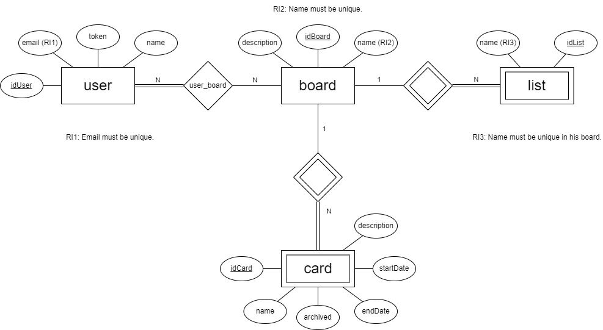
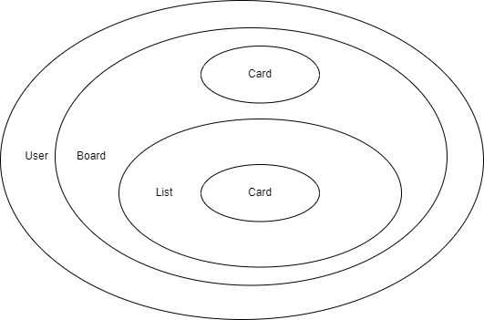
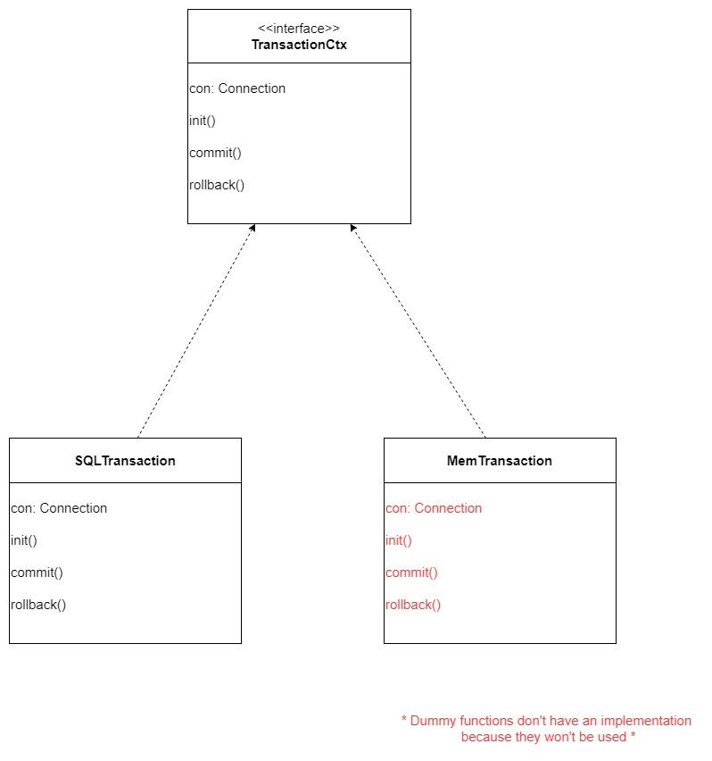
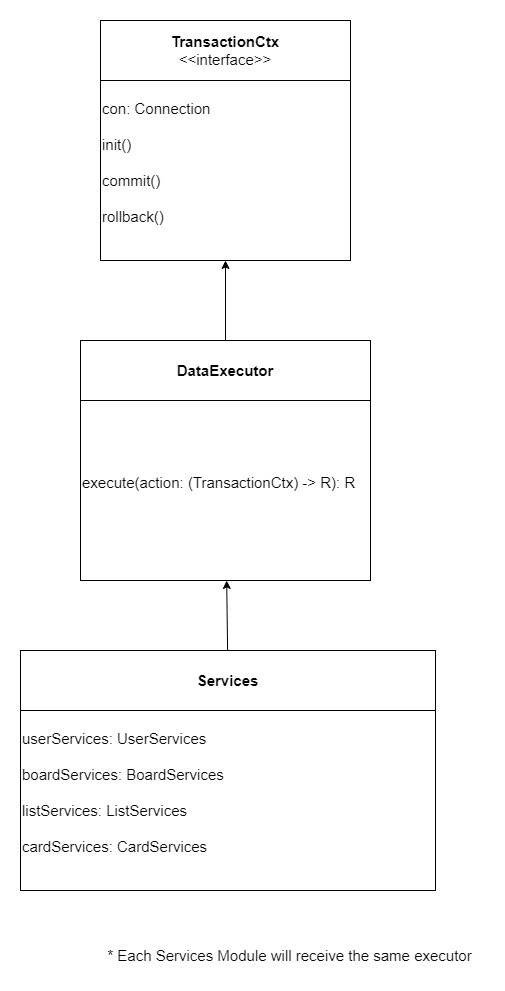
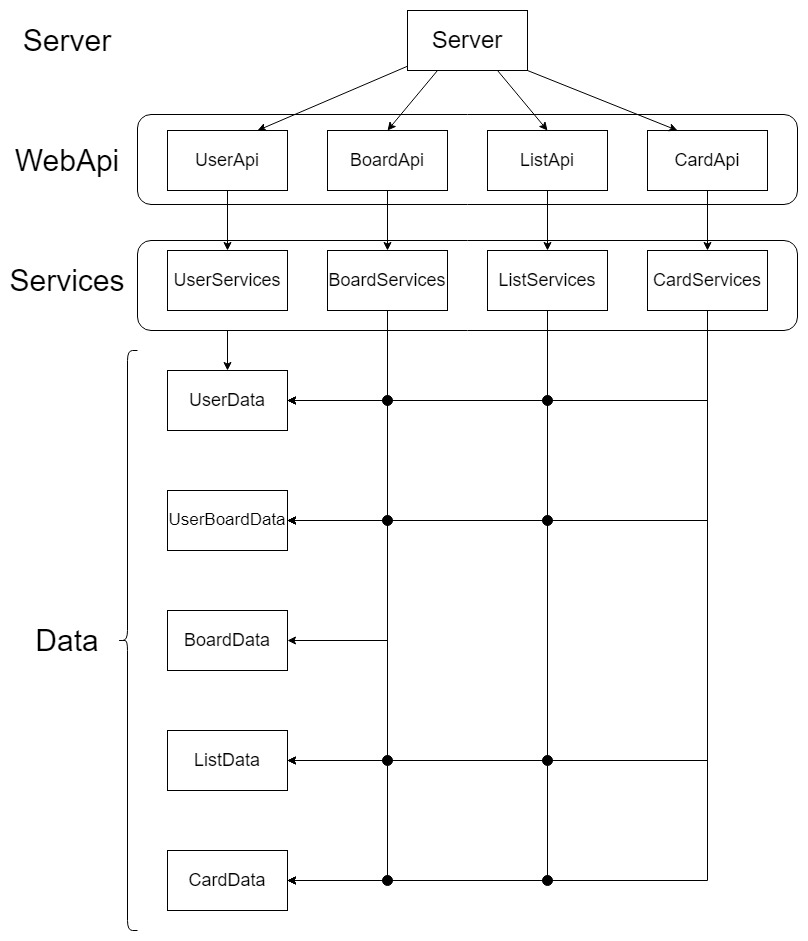
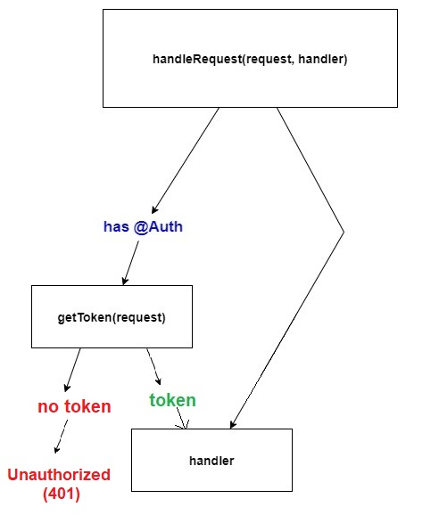
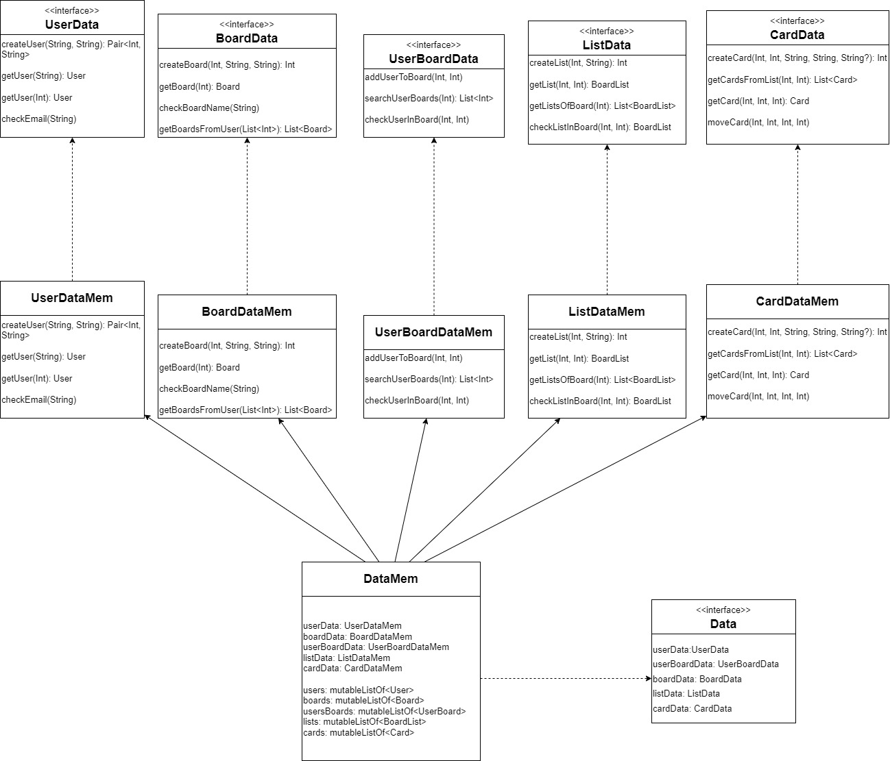
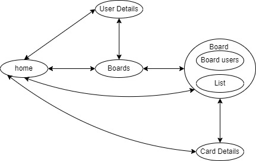
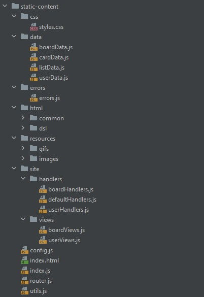

# LS Project Phase 2
## Introduction
This document presents the design and implementation aspects of the LS Project. <br>
The system is designed to manage information related to Trello Boards and their elements, such as boards, lists and cards.<br>

This application aims to provide a task management system. <br>
It allows users to create, read, update and delete tasks, as well as organize them in different categories including the usage of the entities: <br>
User, Board, List, Card most of them inside [Structs.kt](../src/main/kotlin/pt/isel/ls/server/utils/Structs.kt). <br>

The application is built using the Kotlin programming language and follows a RESTful API architecture, where data is exchanged in JSON format.\
The application also provides an Open-API specification that documents the API endpoints and their usage.

## Modeling the Database
### Conceptual Model
The following diagram shows the Entity-Relationship model for the system's information management.




We highlight the following aspects of the conceptual model:

__Boards__ have a title and description.\
__Lists__ belong to a board and have a title.\
__Cards__ can or not belong to a list and have a title, description, position, start date and due date.
The conceptual model has the following restrictions:

- A board can have multiple lists.
- A list can have multiple cards.
- A card can belong to only one list or none.



### Physical Model
The physical model of the database is available in the [SQL script](../src/main/sql/createTable.sql) with the schema definition.

We highlight the following aspects of this model:

The tables are named __user__ , __user_board__ (*) , __board__, __list__, and __card__.
The columns are named after the __attributes__ of the conceptual model.
The foreign keys are properly defined to maintain the relationships.

(*) In a many-to-many relationship between user and board, where each user can be associated with multiple boards and each board can be associated with multiple users. <br>
We cannot directly represent this relationship with only user and board tables.

In this case, the __user_board__ table serves as the junction table that connects the user and board tables.<br>
It contains foreign keys to both user and board tables, as well as any additional columns that are specific to the relationship between a user and a board.
## Software Organization
### Open-API Specification
The [OpenAPI](../docs/apiRoutes.yaml) specification for the system is available in the YAML file.

In our Open-API specification, we highlight the following aspects:

- The endpoints are defined for managing users, boards, lists, and cards.
- The request and response formats are properly defined.
- The error responses are properly defined.
- The endpoints are grouped into logical groups.

### Request Details
When a request is received by the system, it goes through the following elements:

The HTTP server receives the request.
The routing middleware routes the request to the corresponding endpoint handler.
The endpoint handler validates the request parameters and calls the appropriate service method.
The service method performs the required data access and returns the response.
The endpoint handler returns the response to the client.
The relevant classes/functions used internally in a request are:

[TasksServer.kt](../src/main/kotlin/pt/isel/ls/server/TasksServer.kt) : the HTTP server implementation.
[HandleRequest](../src/main/kotlin/pt/isel/ls/server/api/AuxWebApi.kt) : the routing middleware implementation.
[API Module](../src/main/kotlin/pt/isel/ls/server/api): the functions that handle the requests for each endpoint.
[Service Module](../src/main/kotlin/pt/isel/ls/server/services): the classes that perform the data access and business logic for each endpoint.
The request parameters are validated in the endpoint handler functions, using the HTTP4K library's validation functions.

### Connection Management

In this last phase of the project we implemented an executor to handle all transactions.

The executor plays a crucial role in maintaining a single connection to perform all operations in the database, ensuring consistency and efficiency. By encapsulating the transaction management logic, it simplifies the process of handling database operations and ensures that they are executed within a transaction context.

One of the main advantages of using the executor is that it abstracts away the complexity of managing transactions and connections, making the code cleaner and easier to maintain. It uses a unified interface for executing database operations, regardless of whether they are executed in a SQL transaction or a memory transaction.

The DataExecutor class is utilized to execute database operations within a transaction context defined by the TransactionCtx interface. This allows us to use it with a given implementation (Memory or SQL) and utilizes a connection to perform transactions. The SQLTransaction class uses connection from a PGSimpleDataSource to perform SQL transactions. On the other hand, the MemTransaction class represents a memory transaction and does not require a connection.



By using the executor, the Services modules can focus on implementing the business logic for data-related operations without worrying about managing transactions explicitly. It can delegate the responsibility of executing the database operations to the executor, which takes care of initializing, committing, and rolling back the transactions as needed.



It's worth noting that the executor is not used in the case of memory transactions (MemTransaction). Since memory transactions do not require a connection, the con property is not accessed, and the custom getter never throws the UnsupportedOperationException. This design decision is appropriate because memory transactions operate solely in memory and do not involve database interactions, it only serves the interface signature.

### Data Access
The dataSQL class is responsible for data access. It provides helper functions for executing SQL statements and mapping the results to domain objects.

SQL statements that are used for querying the data related to a board, list, or card are stored in [Statements](../src/main/kotlin/pt/isel/ls/server/data/dataPostGres/statements) in their respective object..

### Module's division
The module's division, was made so each module is independent, reused and have easier maintenance throughout whole the project. 



The division was made in a way where each entity in your conceptual module has its own routes in server, Api, services logic and storage.
This makes bugs in your app easier to find and fix, as well not mix the services logic behind each entity.

### Request and Error Handling
Every API method utilizes the HandleRequest function in [API](../src/main/kotlin/pt/isel/ls/server/api/AuxWebApi.kt) to handle requests and produce possible errors in an efficient and effective manner. When a required parameter is missing from a request, the HandleRequest function detects the error and returns an error message with the appropriate 400 status code, indicating that a parameter is missing.


This function checks if the handler method received as a parameter has the `Auth` annotation which symbolizes that the operation requires the user to be authenticated to be completed. If this isn't the case it simply calls the handler function to process the request.
Otherwise, it calls the `getToken` method to extract the request's token and pass it to the handler function.




To handle specific error situations, the API uses the TrelloException class, which defines custom exceptions with associated HTTP status codes and error messages. This class is a sealed class that extends the base Exception class and includes six subclasses: NotAuthorized, NotFound, IllegalArgument, AlreadyExists, NoContent and InternalServerError.

Each of these subclasses is designed to handle a specific error scenario. For example, the NotAuthorized subclass handles unauthorized operations (eg.: missing token) and returns an error message indicating that the requested operation is not authorized. Similarly, the NotFound subclass returns an error message indicating that the requested object is not found, while the IllegalArgument subclass returns an error message indicating that the parameters supplied are invalid. The AlreadyExists subclass, on the other hand, returns an error message indicating that the requested object already exists. The NoContent subclass, indicates whether the delete operation, has deleted an object. The InternalServerError is used when is thrown an error the handler isn't ready to handle.  

By utilizing the TrelloException class, the API can effectively handle a wide range of error situations while providing clear and concise error messages to users. This approach helps to improve the user experience by providing helpful feedback and reducing confusion when errors occur.

### Interfaces and Dependency Injection
To enable flexibility in our project and accommodate for possible changes in the future, we have opted to use multiple interfaces for different modules. This approach allows us, or future developers, to inject different dependencies with different implementations as needed. For instance, in the Services module, we can receive data through the Data interface, which can be implemented in various ways - data can be stored in memory or in a database, depending on the implementation of this module. 
This way, we can easily swap out dependencies without having to modify the codebase.



### Pagination

Web API GET operations that return a large sequence can be challenging to handle by clients. To alleviate this problem, paging is often employed.  <br>
Paging allows the client to request a subsequence of the entire sequence. Paging is achieved by specifying two parameters: limit, which is the length of the subsequence to return, and skip, which is the start position of the subsequence to return.

#### Implementation

To implement paging in a Web API GET operation, the server must be able to determine the number of items in the sequence, and apply the paging parameters to return the requested subsequence. <br>
We have implemented a checkPaging function to calculate the subsequence to return, given the paging parameters and the total number of items in the sequence.

```kotlin
fun checkPaging(max: Int, limit: Int?, skip: Int?): Pair<Int, Int> {
    val skipped = if (skip == null || skip < 0) 0 else min(skip, max)
    var limited = if (limit == null || limit < 0 || skipped + limit > max) max - skipped else limit
    if (skipped > limited) limited = skipped
    return Pair(skipped, limited)
}
```

The __checkPaging__ function takes three parameters: 
- __max__, which is the total number of items in the sequence; 
- __limit__, which is the requested length of the subsequence;
- __skip__, which is the requested start position of the subsequence. <br>

Once the subsequence is determined, the server can return the requested items to the client. <br>

Paging is an effective mechanism for handling large sequences in Web API GET operations. By specifying the paging parameters, clients can retrieve a subsequence of the entire sequence, reducing the load on both the server and the client.

### Aditional Operations

The move card operation has been updated to receive two new parameters:
- __lid__ stands for the identifier of the destination list where the card is going to be moved. <br>
- __cix__ is the new index for the card in the destination list. <br>

The __deleteCard__ and __deleteList__ operations have also been implemented correctly and are working properly. The __getUsersFromBoard__ operation has been added to retrieve the list of users associated with a particular board.

Overall, these additional operations have been integrated smoothly into our Trello API and enhance the functionality of our application.

### Otimization regarding the fetching of data

The DataExecutor interface is designed to handle the execution of database operations and provide a convenient way to work with database connections. <br>
It abstracts away the connection management and provides a clean interface for executing actions on a database connection. <br>
The usage of DataExecutor helps in reducing the number of fetch operations required to execute multiple database operations. It encapsulates the common connection handling logic and provides a single entry point (execute function) for executing actions on the database.

## Single Page Application

This implementation is using a Single Page Application (SPA) using JavaScript, HTML, and CSS. The SPA provides a web user interface for the GET operations developed in the first phase. The application is divided into two parts: a router and a set of handlers.

The router defines the routes that the application can handle and the corresponding handlers that should be called when each route is accessed. The handlers implement the logic for each route, fetching data from the API and rendering it on the page.


### Router
The Router is responsible for keeping track of the current URL and navigating between different pages without reloading the entire page. <br>
It does this by listening for changes in the URL, parsing it, and calling the appropriate handler function to update the content displayed on the page. <br>
In essence, it helps the application to maintain its state and keeps track of the user's current location within the application.

### Handlers
The Handlers are functions that define how to render the different pages or views in the application. <br>
They receive data from the server and use it to update the DOM, displaying the appropriate content on the page. <br>
Each handler corresponds to a different route, which is a unique URL that maps to a specific view or page in the application.

### App
The App ties everything together, serving as the main entry point to the SPA. <br>
It initializes the Router and Handlers, listens for events such as the page load and URL changes, and calls the appropriate handler function to update the content displayed on the page.<br>
In short, the App is the glue that holds the different components of the SPA together, making it work as a cohesive whole.

Next image shows each HTML views can be accessed depending on your current view: 
 

We decided to make Boards and Lists accessible in the same view, just like original Trello website
and make every able to jump to home view.

In summary, the __Router__, __Handlers__, and __App__ work together to create a dynamic and responsive SPA that can navigate between different views and pages without reloading the entire page.

#### App Features

##### Search Feature
The App Search Feature is a search bar that allows users to search for boards by name and/or number of lists. <br>
This implementation that we have developed features a dropdown which displays the possible options of the filters to be
applied to the search. <br>

Explaining a little furthermore the search bar using the name filter. Supposedly, the user chooses the option correspondent
to the name filter, then when proceeding to search it displays in the query string the correct property with its value. After that,
the api, services and dataMem method that is responsible for the search is called and its signature have both name and numLists with String? and Int? 
respectively. <br>

##### Number of Lists in a Board Card Feature

We decide to add a feature that displays the number of lists in a board card. This feature is implemented in the board view and in the search view 
when displaying the board cards. <br>

##### App Move Card Feature

The App Move Card Feature is a feature that allows users to move cards between lists in board. <br>
The Card can be moved to a different list by clicking on the card and dragging it to the desired list. <br>
We used dragover, dragend and drop event listeners events to achieve this
as well as the dataset attribute on each card element to keep track of its index.

##### Pagination Buttons Feature

The Pagination Buttons Feature is a feature that allows users to navigate between pages of boards. <br>
The buttons are displayed at the top of the page and can be used to go to the previous or next page. <br>
There are also indexes of the pages displayed in the middle of the previous and next buttons. <br>
When clicking a certain index card it shows the content of that page. <br>

### Login, Logout and SignIn

Before the implementation of the Login and SignIn operations, in the database, the user's password column was added to the table. In addition, the avatar image url was also added to the same table. <br>
The Login operation is implemented using a new endpoint that receives the user's email and password and returns a token if the credentials are valid. <br>
The SignIn operation is implemented using an already existing endpoint that receives the user's email, name, password and avatar, returning a token if the credentials are valid. <br>

In the login and signin operations, in order to save and utilize the value of a given token, the usage of the  __sessionStorage__ seems the best approach. <br>
The __sessionStorage__ is a web storage object that stores data in the browser's session, which means that the data is stored until the browser or tab is closed. <br>
In our case, the token is stored in the sessionStorage and is used in the requests to the API when using the auxiliar function __fetchReq__. <br>

The Logout operation is simply implemented by removing the token from the sessionStorage. <br>

### Frontend Organization

We have made efforts to improve the organization of our frontend code by following the package convention in Java. This approach aims to bring structure and order to the project, making it easier to navigate and maintain.

By adhering to the package convention, we have grouped related files and components into logical units, represented by packages. This organization allows for better separation of concerns and helps us locate specific files more efficiently.

We have also tried to implement a parallel structure to our backend division for better reading. In this structure, our index.js serves as the entry point for each request (same as WebAPI). Similar to our backend routes module, the router.js file facilitates routing of the requests. 

The handlers in our system act as the Services module, responsible for retrieving information from the data layer, which connects to our backend. 

Finally, the retrieved data is passed to a view module, which generates the requested page.

By adopting this organized approach, we have optimized the flow of data and improved the overall structure of our system.



### Security of Passwords

The security of passwords is a very important aspect of any application. <br>
In our case, before inserting the user's password directly to the database, it is used the __algorithm SHA-256__ to hash the given password. <br>
This algorithm is a cryptographic hash function that takes an input of any length and produces a fixed-length output. <br>
In this way, the password is not stored in the database in plain text, but rather in a hashed form. <br>


## Critical Evaluation
Functionality that is not yet concluded:

None identified.
Identified defects:

None identified.
Improvements to be made in the next phase:

Improve the error handling and processing by adding more detailed error messages.
Add support for pagination in the endpoints that return a list of items. 
Make tests more optimized : avoid repeating same actions in test like creating a list and avoid repeating similar actions in DataSQL.


